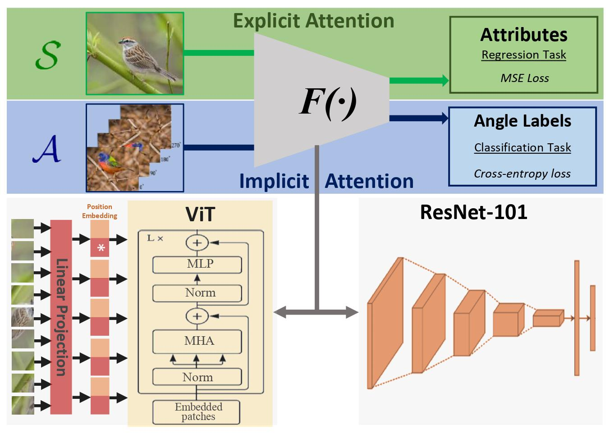

#  Implicit and Explicit Attention For Zero-Shot Learning 
## Abstract 

Zero-Shot Learning (ZSL) aims to recognise unseen object classes, which are not observed during the training phase. Most of the existing methods focus on learning a compatibility function between the image representation and class attributes. Few others concentrate on learning image representation combining local and global features. However, the existing approaches still fail to address the bias issue towards the seen classes. In this paper, we propose implicit and explicit attention mechanisms to address the existing bias problem in ZSL models. We formulate the implicit attention mechanism with a self-supervised image angle rotation task, which focuses on specific image features aiding to solve the task. The explicit attention mechanism is composed via the consideration of a multi-headed self-attention mechanism in Vision Transformer model, which learns to map image features to semantic space during the training stage. We conduct comprehensive experiments on three popular benchmarks: AWA2, CUB and SUN. The effectiveness of our proposed attention mechanisms is evaluated in both discriminative and generative settings, and has been proven in both cases to be effective. We achieve the state-of-the-art harmonic mean on all three datasets.

Explicit +  Implicit Attention
As provided in [Explicit and Implicit_Attention](Explicit_Implicit_Attention):
Explicit +  Implicit Attention as depicted below is implmeneted using: <br />
i) ResNet101 as in [Resnet101_Explicit+ImplicitAttention](Explicit_Implicit_Attention/Explicit_AND_Implicit_Attention--ResNet101.ipynb)<br />
ii) ViT as in [ViT_Explicit+ImplicitAttention](Explicit_Implicit_Attention/Explicit_AND_Implicit_Attention--ViT.ipynb)




## Usage:
#### 1) Download the datasets
Follow the instructions provided in [data/Dataset_Instruction.txt](data/Datasets_Instruction.txt)


#### 2) Create a conda environment:
Refer to: [Conda Environment](https://conda.io/projects/conda/en/latest/user-guide/tasks/manage-environments.html) for more information. 
```
# conda create -n {ENVNAME} python=3.6
conda create -n ViT_ZSL python=3.6

# Activate the environment: conda activate {ENVNAME}
conda activate ViT_ZSL
```
#### 3) Required libraries :
This is a [PyTorch](https://pytorch.org/get-started/locally/) implementation
```
pip install -r requirements.txt 

# PyTorch
conda install pytorch torchvision torchaudio cudatoolkit=11.1 -c pytorch -c nvidia
```
#### 4) Train (and test) the model
open jupyter notebook(s) provided in [Explicit and Implicit_Attention](Explicit_Implicit_Attention)
```
jupyter notebook {NAME-of-jupyter notebook}.ipynb
```


## External sources:

- [Timm](https://pypi.org/project/timm/)
- [Transformer](https://github.com/huggingface/transformers)
- [ViT](https://github.com/google-research/vision_transformer)
- [Vision_Transformer_Tutorial](https://colab.research.google.com/github/hirotomusiker/schwert_colab_data_storage/blob/master/notebook/Vision_Transformer_Tutorial.ipynb#scrollTo=3f7gQ89cvAnv)

